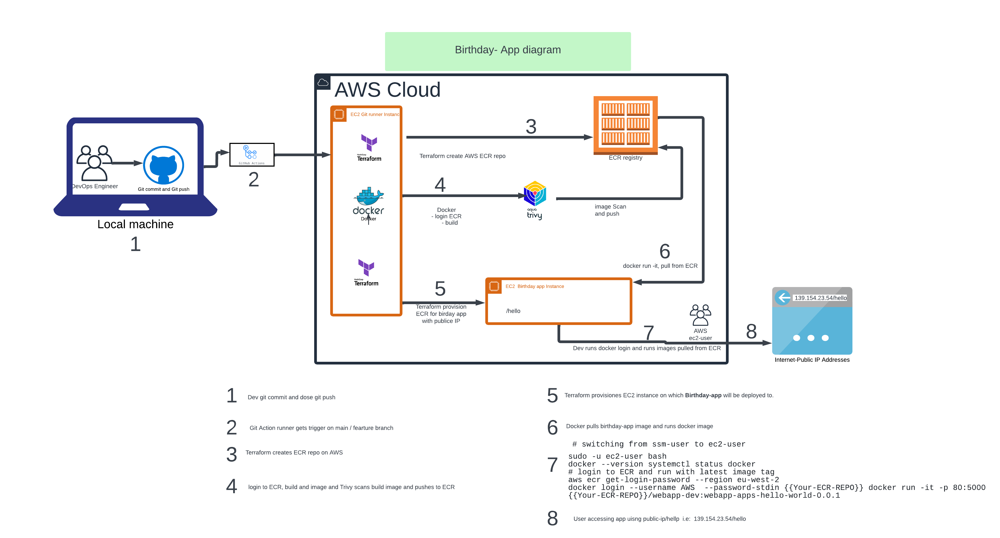

# Birthday-app

## Birthday app - diagram:



## Container - Build Child Docker Image, Scan and Push to ECR

This directory includes two main deployment parts:
1. Create a AWS ECR repository
2. Build child docker image from base image, scan and push to ECR

## Usage Part1 - Create an AWS ECR repository

To see all Make targets and their description run following command:

```bash
make help

# to run particular target, e.g.
make init
```

### Provision AWS ECR resources locally

Execute make targets:
```bash

# Note: always run locally before commiting any changes
make fmt

# if no error(s) run
make init

# again, if no error(s) then run
make validate

# and again, if no error(s) just execute
make plan

# review plan output, and deploy
make apply

# Clean up
# Note: this will destroy all resources
make destroy
```

### Provision ECR resources via github actions CI

The github actions `deploy-ecr.yml` pipeline will be triggered when certain conditions have been met such as:
changes been applied to the `docker-hello-world-app/terraform/` directory only AND commits been pushed either from `main` or any `feature/` branches.


## Usage Part2 - Build child docker image, scan and push it to ECR locally

Execute make targets:
```bash

# Note: always run locally before commiting any changes
make lint

# login to ECR
make login-ecr

# build and tag container image
make build

# run vulnerability scanner
make image-scan

# push to ECR 
make push

# run locally to clean up after push
make cleanup
```

### Provision ECR resources via github actions CI

The github actions `build-image-push.yml` pipeline will be triggered when certain conditions have been met such as:
changes been applied to the `docker-hello-world-app/src/` directory only AND commits been pushed either from `main` or any `feature/` branches.

### Test deploying the 'Hello World' app image

Access the [AWS EC2 console](https://eu-west-2.console.aws.amazon.com/ec2/home?region=eu-west-2#Instances:) locate the `web-app-hello-world` EC2 instance and connect via SSM Manager then run folling commands:
```bash
# switching from ssm-user to ec2-user
sudo -u ec2-user bash
docker --version
systemctl status docker
# login to ECR and run with latest image tag
aws ecr get-login-password --region eu-west-2 | docker login --username AWS  --password-stdin {{Your-ECR-REPO}}
docker run -it -p 80:5000 {{Your-ECR-REPO}}/flask-webapp-dev:frontend-apps-hello-world-0.0.1
```

Then locate and click on the public IP of the `web-app-hello-world` EC2 instance. On the URL bar change to `http:\\<ec2-public-IP>`
